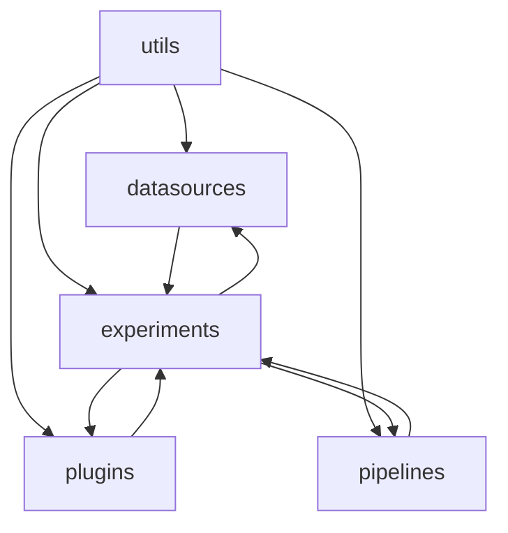

# Crystallize Framework Architecture

## Overview
Crystallize enables reproducible data-science experiments by structuring runs as pipelines executed under an immutable context. Experiments orchestrate data fetching, pipeline execution, treatment application, and hypothesis testing while plugins extend behavior such as logging, seeding, and artifact storage.

## Modules

### datasources
- **Responsibility:** Provide input data and artifact handles for experiments.
- **Key Files:**
  - `artifacts.py` – declarative wrapper for reading and writing experiment artifacts.
  - `datasource.py` – abstract base class for data providers and the `ExperimentInput` aggregator.
  - `__init__.py` – exposes artifact utilities.
- **Relationships / Dependencies:** Uses `utils.context` for execution context and interacts with `plugins.ArtifactPlugin` for persistence. `ExperimentInput` may depend on outputs from other experiments.
- **Notes / Edge Cases:** `ExperimentInput` validates replicate counts across artifact inputs and raises on conflicts or missing inputs.

### experiments
- **Responsibility:** Define and execute experiments, manage treatments and hypotheses, and aggregate results.
- **Key Files:**
  - `experiment.py` – core runner coordinating data sources, pipelines, plugins, and replicates.
  - `experiment_builder.py` – fluent builder for assembling experiments.
  - `experiment_graph.py` – constructs and runs DAGs of dependent experiments.
  - `hypothesis.py` – encapsulates statistical tests and treatment ranking.
  - `optimizers.py` – base optimizer interface and objective definition.
  - `result.py` – wrapper for experiment metrics, artifacts, and provenance.
  - `result_structs.py` – dataclasses for structured metrics and aggregate data.
  - `run_results.py` – container for per-replicate outputs.
  - `treatment.py` – applies context mutations representing experimental conditions.
  - `__init__.py` – aggregates public experiment APIs.
- **Relationships / Dependencies:** Relies on `datasources` for input and artifacts, `pipelines` to run steps, `plugins` for extensibility, and `utils` for context, caching, and exceptions.
- **Notes / Edge Cases:** Experiment DAG loader auto-resolves upstream artifacts; misuse can trigger cycle or missing-artifact errors.

### pipelines
- **Responsibility:** Define ordered steps that transform data under an immutable context.
- **Key Files:**
  - `pipeline_step.py` – abstract interface for steps with hashing for caching.
  - `pipeline.py` – executes steps sequentially with caching and provenance tracking.
  - `__init__.py` – exposes pipeline primitives.
- **Relationships / Dependencies:** Uses `utils.context` and `utils.cache`; interacts with experiment plugins via hook calls.
- **Notes / Edge Cases:** Steps marked cacheable store outputs keyed by both step and input hashes; cache corruption raises `IOError`.

### plugins
- **Responsibility:** Extend experiment lifecycle with logging, seeding, artifact persistence, and alternative execution loops.
- **Key Files:**
  - `plugins.py` – base plugin interface plus `SeedPlugin`, `LoggingPlugin`, and `ArtifactPlugin` implementations.
  - `execution.py` – execution strategy plugins for serial, threaded/process, or asyncio-based runs.
  - `__init__.py` – exports available plugins.
- **Relationships / Dependencies:** Plugins hook into `experiments.Experiment` and may interact with `pipelines` (e.g., artifact writes). `ArtifactPlugin` reads constants from `utils.constants`.
- **Notes / Edge Cases:** `ParallelExecution` requires picklable experiments; non-picklable resources should be created via `resource_factory`.

### agentic
- **Responsibility:** Provide a thin, agent-oriented harness built on top of the public pipeline APIs.
- **Key Files:**
  - `agentic/schema.py` – immutable `Claim` and `Spec` dataclasses that flow through steps.
  - `agentic/steps.py` – pipeline steps for claim injection, spec generation, bounded synthesis, sandboxed execution, and metamorphic property evaluation.
  - `agentic/verifiers.py` – verifier factories for metamorphic properties and acceptance checks.
  - `plugins/provenance.py` – plugins to persist LLM prompt metadata and structured evidence bundles.
- **Relationships / Dependencies:** Uses core decorators (`pipeline_step`, `verifier`), immutable contexts, and artifact plugins for persistence. Designed to compose without modifying the existing experiment runner.
- **Notes / Edge Cases:** The bounded execution capsule whitelists imports, rejects common dunder escalation patterns, diffs loaded modules, and sets CPU/memory/file limits; attempts to run disallowed code raise `BoundedExecutionError` before execution or when sandbox policies are violated. Metamorphic tests require the raw dataset and generated code to be present in the context.

### utils
- **Responsibility:** Provide shared infrastructure such as immutable contexts, caching, decorators, dependency injection, and custom exceptions.
- **Key Files:**
  - `context.py` – defines `FrozenContext`, `LoggingContext`, and metric tracking.
  - `cache.py` – hashing and file-based cache helpers.
  - `decorators.py` – factories for pipeline steps, treatments, hypotheses, and data sources plus resource caching utilities.
  - `injection.py` – injects context values into callables automatically.
  - `constants.py` – common string literals used across modules.
  - `exceptions.py` – framework-specific exception hierarchy.
  - `__init__.py` – exports utility conveniences.
- **Relationships / Dependencies:** Used by all other modules; decorators reference `experiments`, `pipelines`, `plugins`, and `datasources` to expose high-level factory APIs.
- **Notes / Edge Cases:** `inject_from_ctx` clones artifacts with context awareness; misuse may lead to unpicklable callables.

## Inter-Module Dependencies

## Open Questions & To-dos
- How should experiments handle version conflicts when multiple artifact plugins point to the same directory?
- The experiment DAG loader quietly assumes directories named after experiments; clarify behavior when names diverge from folder structure.
