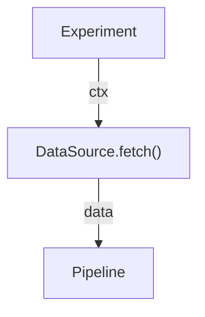

## Data Source

A `DataSource` is an abstraction for fetching or generating input data for a `Pipeline`. It decouples data acquisition from processing, allowing experiments to work with diverse sources (e.g., files, APIs, simulations) while maintaining reproducibility.

The `DataSource` receives the `FrozenContext`, which can parameterize fetching (e.g., selecting different data files based on context keys set by treatments).

### Why Data Sources?

By isolating data loading, you can swap sources without changing the experiment logic. It also supports validation and caching, ensuring data integrity.

### How It Works

Subclass `DataSource` and implement `fetch(ctx: FrozenContext) -> Any`. The output can be any data structure (e.g., pandas DataFrame, numpy array) passed to the `Pipeline`.

Simple flow:



### Minimal Implementation Example

```python
from crystallize.core import DataSource
from crystallize.core.context import FrozenContext
import pandas as pd

class CSVDataSource(DataSource):
    def __init__(self, path: str):
        self.path = path

    def fetch(self, ctx: FrozenContext) -> pd.DataFrame:
        # Could use ctx to override path, e.g., path = ctx.get('csv_path', self.path)
        return pd.read_csv(self.path)
```

### Trade-offs

| Aspect                | Pros                            | Cons                                                                 |
| --------------------- | ------------------------------- | -------------------------------------------------------------------- |
| **Decoupling**        | Flexible source switching.      | Adds a layer of abstraction.                                         |
| **Caching Potential** | Can implement internal caching. | Freshness vs. speed trade-off (e.g., no auto-refresh for live data). |

Links: Used in [Experiment](#experiment); receives [Immutable Context](#immutable-context-frozencontext).
