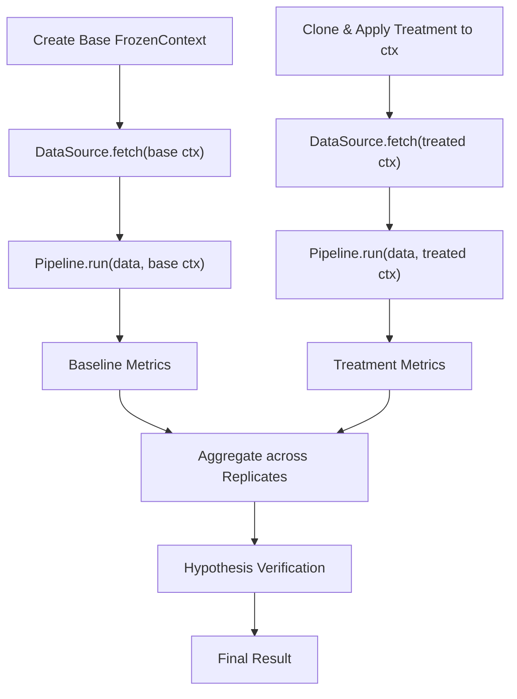

## Experiment

The `Experiment` is the top-level abstraction in Crystallize, serving as the entry point for defining and executing a structured scientific inquiry. It orchestrates the entire experimental process: fetching data, applying transformations via pipelines, introducing variations through treatments, collecting metrics across replicates, and verifying hypotheses with statistical tests.

### Why Experiments?

Data science and machine learning workflows often involve testing hypotheses under controlled variations, but without structure, they can become chaotic and irreproducible. Crystallize's `Experiment` enforces best practices by:

- Ensuring reproducibility through immutable contexts and provenance tracking.
- Supporting multiple replicates to account for stochasticity (e.g., random seeds in ML training).
- Automating hypothesis verification to reduce bias and errors.

This design promotes clarity, allowing you to focus on science rather than boilerplate.

### How It Works

An `Experiment` ties together a `DataSource` (input), `Pipeline` (processing), `Treatments` (variations), and `Hypothesis` (verification). It runs a baseline condition and one or more treatment conditions across a specified number of replicates, aggregating metrics and testing the hypothesis.

The variation introduced by treatments affects the immutable `FrozenContext` passed to both the `DataSource` and `Pipeline`. This means the same `DataSource` and `Pipeline` are used for baseline and treatments, but the context can alter data fetching (e.g., loading different files) or pipeline behavior (e.g., changing hyperparameters used in steps).

Here's a high-level flow:



- **Context-Driven Variation**: Treatments modify the cloned context, which influences `DataSource.fetch()` and `Pipeline.run()`.
- **Replicates**: The process (baseline + treatments) repeats N times to build sample distributions.
- **Same Components**: No separate pipelines; differences stem from context.

### Minimal Example

```python
from crystallize.core import Experiment, Pipeline, DataSource, Hypothesis, Treatment
from crystallize.core.stat_test import WelchTTest  # Example statistical test

# Define components (details in later sections)
datasource = DataSource(...)  # e.g., loads a dataset
pipeline = Pipeline(steps=[...])  # e.g., preprocess, train, evaluate
hypothesis = Hypothesis(metric="accuracy", direction="increase", statistical_test=WelchTTest())
treatment = Treatment(name="high_lr", apply_fn=lambda ctx: ctx.__setitem__]({"learning_rate", 0.01"})

# Instantiate and run
experiment = Experiment(
    datasource=datasource,
    pipeline=pipeline,
    treatments=[treatment],
    hypothesis=hypothesis,
    replicates=5,  # Run 5 times for statistical power
)
result = experiment.run()

# Inspect
print(result.metrics)  # Dict with baseline and treatment metric samples
print(result.metrics["hypothesis"])  # e.g., {'p_value': 0.03, 'significant': True, 'accepted': True}
```

### Trade-offs

| Aspect                  | Pros                                               | Cons                                                             |
| ----------------------- | -------------------------------------------------- | ---------------------------------------------------------------- |
| **Linear Flow**         | Simple to reason about; enforces sequential logic. | Less flexible for complex DAGs (use custom steps for branching). |
| **Built-in Replicates** | Handles variability automatically.                 | Increases compute time; set to 1 for quick tests.                |
| **Immutable Design**    | Guarantees reproducibility.                        | Requires upfront planning.                                       |

For more on components, see [Pipeline and Steps](#pipeline-and-steps), [Data Source](#data-source), [Immutable Context](#immutable-context-frozencontext), and [Treatments, Hypotheses, and Statistical Validation](#treatments-hypotheses-and-statistical-validation).
