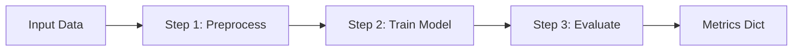

## Pipeline and Steps

A `Pipeline` is a linear sequence of `PipelineStep` objects that transform input data into output metrics dict. It acts as the computational engine within an `Experiment`, ensuring deterministic transformations while supporting caching for efficiency.

### Why Pipelines?

Pipelines decouple data processing from experiment orchestration, promoting modularity and reuse. By enforcing a sequence of steps, they make workflows explicit and easier to debug, while built-in hashing enables provenance and caching.

### How It Works

Each `PipelineStep` is an abstract class you subclass, implementing `__call__` (the transformation) and `params` (for hashing). The `Pipeline` chains them: output of one step becomes input to the next. The final step **must** return a `Mapping[str, Any]` of metrics (e.g., `{"accuracy": 0.95}`).

Context is passed immutably to each step via `FrozenContext` (see [Immutable Context](#immutable-context-frozencontext)).

Visualization of chaining:



### Full Assembly Example

```python
from crystallize.core import PipelineStep, Pipeline
from crystallize.core.context import FrozenContext

class PreprocessStep(PipelineStep):
    def __init__(self, normalize: bool = True):
        self.normalize = normalize

    @property
    def params(self) -> dict:
        return {"normalize": self.normalize}

    def __call__(self, data: Any, ctx: FrozenContext) -> Any:
        # Example: normalize data if flag set
        if self.normalize:
            return (data - data.mean()) / data.std()
        return data

class EvaluateStep(PipelineStep):
    @property
    def params(self) -> dict:
        return {}

    def __call__(self, model: Any, ctx: FrozenContext) -> dict:
        # Example: compute metrics
        return {"accuracy": 0.95}  # Replace with real evaluation

# Assemble
pipeline = Pipeline(steps=[PreprocessStep(), EvaluateStep()])

# In an Experiment, it's run as pipeline.run(data, ctx)
```

### Trade-offs

| Aspect                 | Pros                         | Cons                                                 |
| ---------------------- | ---------------------------- | ---------------------------------------------------- |
| **Linearity**          | Easy to implement and trace. | No native branching; implement in custom steps.      |
| **Caching**            | Speeds up repeated runs.     | Cache invalidation requires careful hash management. |
| **Metric Enforcement** | Ensures consistent outputs.  | Final step must always return a dict.                |

See [Experiment](#experiment) for integration and [Immutable Context](#immutable-context-frozencontext) for context details.
